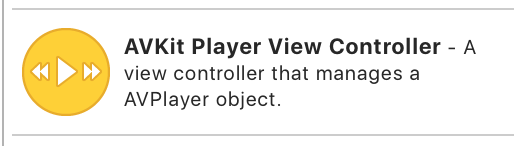

#動画再生機能を作ってみよう

### はじめに
 皆さんこんにちは。最近動画配信アプリが多い気がするのは私だけでしょうか。自分でもやって見たくなったので、動画再生をテーマに記事を書いて見ました。動画再生入門の方はこれを機にやってみましょう！

### 動画再生するには？
#### 動画再生方法
　アプリ上で動画を再生する手段としては2つあります。ざっと紹介していきます。

* UIWebView
* AVPlayer

##### UIWebView
　最も簡単な方法でいうと、こちらの方法になります。`WebView`は、Webページをアプリ内で表示することができる`View`です。  
　使い方はシンプルで、URLがあればすぐに実装できてしまいます。  
　例えば、`WebView`で`YouTube`を指定すれば、そのアプリはWeb版のYouTubeとまるっきり同じになります。なので、動画再生もアプリ上でそのままされるということになります。アプリ内にブラウザを置けるようなものですね。  
　今回`WebView`はメインで取り上げません。以下サンプルコードで動作すると思うので、試してみてください。

```swift:WebViewサンプルコード
import UIKit

class SampleWebViewController: UIViewController {

    @IBOutlet weak var webView: UIWebView!
    
    override func viewDidLoad() {
        super.viewDidLoad()
        
        let requestURL = URL(string: "https://www.youtube.com/";;)
        let req = URLRequest(url: requestURL!)
        webView.loadRequest(req)
    }
}

```

　注意点としては、実際に表示されるのはWebページなので、ボタン等のオブジェクトに対して操作をすることができません。単純にWebページを表示させたい時に利用してみてください。
　
##### AVPlayer
　`WebView`ではカスタマイズができませんでしたが、こちらのライブラリでは色々カスタマイズすることができます。本格的に動画再生機能を実装したい場合、現在だとこちらを使うことになると思います。例えば、動画再生・停止を制御したり、音声を調整したりです。実装方法は`WebView`と比べるとコード量は増えますが、圧倒的にできることが増えます。  
　今回は`AVPlayer`を使った実装を試したので、後ほどの節でサンプルコードとともに紹介します。  
　ちなみに、`AVPlayerViewController`オブジェクトが`StoryBoard`に用意されているので、そちらを使えば簡単に`View`を作ることができますよ。
　
#### おまけ
　iOS2~iOS9の間では、`MPMoviePlayer`というものが標準ライブラリで使えました。しかしiOS9から`deprecated`なり、それ以降は`AVPlayer`がメインになったようです。  
　なので、簡単に実装したいときは`WebView`、カスタマイズしたい場合は`AVPlayer`と覚えておくと良いかもしれません。

### シンプルな動画再生機能実装
 では`AVPlayer`を使った動画再生機能の実装手順を、以下のような流れで紹介します。今回は、アセットに動画ファイルを登録し、アプリロード時直後に動画を再生する機能を実装してみます。
 
* 動画ファイルの登録
* `ViewController`の設定
* ストーリーボードの実装
* アプリ起動
 
#### アセットに動画ファイルの登録
　今回は、mp4形式の動画ファイルを用意しています。movファイルでも問題ありません。まずは、動画ファイルをアセットに登録しましょう。ドラックするだけでOKです。登録したアセット名はこの後利用するので、覚えておきましょう。


#### `ViewController`の設定
　`ViewController`は`AVPlayerViewController`を継承したクラスを作成します。そして今回は、ロード時に動画再生をするので`viewDidLoad`に動画読み込み処理を記述していきます。  
　まずは動画ファイルを参照します。動画ファイルは、アセットから`NSDataAsset `として取り出し、一時ファイルとして`NSTemporaryDirectory`に一度保存します。その保存先URLを参照する形になります。  
　まず、一時ファイルとして保存するサンプルコードは以下のようになります。

```
let asset = NSDataAsset(name:"アセット名")
let videoUrl = URL(fileURLWithPath: NSTemporaryDirectory()).appendingPathComponent("アセット名.ファイル形式")
try! asset!.data.write(to: videoUrl)
```

　次はURLを参照して動画を再生させるコードになります。  
　サンプルコードは以下のようになります。動画ファイルURLから`AVPlayerItem`を作成し、`AVPlayer`にセットする感じですね。そして、その`AVPlayer`インスタンスを`AVPlayerViewController `がもつプロパティ`player`に代入します。あとは、`AVPlayer`オブジェクトがもつ制御メソッドを実行するだけで、動画ファイルの制御ができます。今回は再生するだけにしておきます。

```
let item = AVPlayerItem(url: videoUrl)
let videoPlayer = AVPlayer(playerItem: item)
player = videoPlayer
player?.play()
```

　クラスの全体像は以下の通りです。

```swift:AVPlayerViewControllerのサンプルコード
import UIKit
import AVKit

class SampleAVPlayerViewController: AVPlayerViewController {

    override func viewDidLoad() {
        super.viewDidLoad()
        
        let asset = NSDataAsset(name:"アセット名")
        let videoUrl = URL(fileURLWithPath: NSTemporaryDirectory()).appendingPathComponent("アセット名.ファイル形式")
        try! asset!.data.write(to: videoUrl)
        let item = AVPlayerItem(url: videoUrl)
        let videoPlayer = AVPlayer(playerItem: item)
        player = videoPlayer
        player?.play()
    }
}
```

#### ストーリーボードの実装
　`AVPlayer`を使って再生するために用意されている、`AVKitPlayerViewController`を使います。まず、オブジェクトライブラリーから以下のアイコンを選択して、引っ張り出しましょう。



　ロード直後に動画を再生させるため、`initial ViewController`に設定しておきましょう。そして、先ほど作成した`ViewController`を`Custom Class`に設定します。

#### アプリ起動
　これでアプリを起動してみましょう。アプリが起動後、動画の読み込みが始まり、再生されます。シンプルな再生機能はこれで実装できますが、`AVPlayer`オブジェクトが持つメソッドを駆使すれば、ボタンパーツ押下時に動画を一時停止させるなど、任意のタイミングで動画を制御することができるので、試してみてください。

### 発展編 -youtubeの動画再生-
#### youtubeの動画を再生してみよう
　シンプルな動画再生機能は実装できたので、次はyoutubeの動画を再生する機能を実装してみましょう。この章では、youtubeの動画再生機能だけでなく、以下のような機能を有するアプリを作ってみます。

* リポジトリ検索
* 再生機能
* ループ再生
* バックグラウンド再生

この章は以下の流れで紹介していきます。

* ライブラリ紹介
* 必要な設定
* シンプルな動画再生
* リポジトリ検索機能実装
* バックグラウンド再生 & ループ再生
* 両方あわせた実装全体
* アプリ起動

#### ライブラリ紹介
　youtubeの動画はストリーミング再生する必要がありますが、実は`YouTube-Player-iOS-Helper`という公式ライブラリが存在します。最終更新が2016年でリリースビルドバージョンが0.1.6となっており、これ大丈夫か？感が漂っていますが、大丈夫です（笑）  
　また、今回のサンプルコードでは、通信用ライブラリとして`Alamofire`を、パースライブラリとして`SwiftyJSON`を利用しています。これらは、cocoapodsでインストールしておきましょう。

```swift:ライブラリリスト
pod 'Alamofire'
pod 'youtube-ios-player-helper'
pod 'SwiftyJSON'
```

#### 必要な設定
　実装へ入る前に`Goole APIs`へアプリの登録をしなければなりません。というのも、ライブラリ検索時に利用する`YouTube Data API`を使うにはトークンが必要になるためです。もしも、ライブラリ検索をせず、特定の動画再生のみできれば良いという方は`Goole APIs`への登録は必要ありません。  
　トークンが手にはいれば、以下のようなフォーマットでライブラリを検索することができます。後ほど利用するので、トークンを覚えておいてください。

```
https://www.googleapis.com/youtube/v3/search?key=【トークン】&q=youtuber&part=snippet&maxResults=3&order=date
```
#### シンプルな動画再生
　では実際に動画再生機能を実装してみます。
　まずは、肝となるライブラリを`import`しましょう。次に、ストーリーボードのメインView上に新しい`View`を作成し、`Custom class`に`YTPlayerView`を設定します。この`View`がYoutube再生プレイヤー描画領域になります。  
　そして`YTPlayerView`を`ViewController`にアウトレット接続します。あとはこのオブジェクトに動画を`load`させるだけなんですが、そこで必要になってくるのが、`VideoId`です。  
　`VideoId`とはYoutubeの動画再生ページに必ずついているIDです。以下のようなURLフォーマットになっていると思います。ここの`v`パラメーターが`VIdeoId`です。

```
https://www.youtube.com/watch?v=【VideoID】
```

`YouTube Data API`を使うことで取得できる情報には、`VideoId`が含まれています。静的に特定の動画のみを再生したい場合は、ハードコーディングすればOKです。  
　`VideoId`を使った再生は`load`メソッドで実行できます。  
　さらに今回は、自動再生させるためにデリゲートメソッドを実装しておきましょう。`YTPlayerViewDelegate `を採用し、`playerViewDidBecomeReady`メソッドを実装することで、APIの受付が可能になったタイミングで動画が再生されるようになります。（このデリゲートメソッドがない場合、自身でプレイヤーの再生ボタンを押さなくてはいけません。）  
　シンプルな動画再生機能は以上で実装できます。サンプルコードは以下の通りです。

```swift:youtube動画再生機能
import UIKit
import AVFoundation
import youtube_ios_player_helper

class SampleViewController: UIViewController, YTPlayerViewDelegate {

    @IBOutlet weak var playerView: YTPlayerView!
    var videoId = 【任意のVideoId】
    
    override func viewDidLoad() {
        super.viewDidLoad()
     
        playerView.delegate = self
        playerView.load(withVideoId: videoId)
    }
    
    func playerViewDidBecomeReady(_ playerView: YTPlayerView) {
        playerView.playVideo()
    }
}

```

#### リポジトリ検索機能実装
　次はリポジトリ検索機能を実装してみましょう。  
　まずエンドポイントとなるURLを確認します。今回は、以下のフォーマットを利用します。検索キーワードを設定できるようにし、テキストフィールドから入力されたキーワードで検索をかけます。

```
let url = "https://www.googleapis.com/youtube/v3/search?key=【トークン】&q=【検索キーワード】&part=snippet&order=date";
```

このとき、検索結果が5件以上ある場合は、すべてのレスポンスは一度に取得できません。そんなときは、`nextPageToken`があるかどうかで判定します。  
　`nextPageToken`があるときは、まだレスポンスが残っているので再度リクエストする必要があるのです。次のレスポンスは、`nextPageToken`をパラメーターに含めてリクエストします。前のレッスポンスを取得するときは、`prevPageToken`をパラメーターに含める必要があります。今回は、テーブルビューで5件表示し、残りはボタン押下時に再取得するようにしてみました。  

```swift:再取得時のサンプル
@IBAction func nextPage(_ sender: Any) {
    let newUrl = "\(url)&pageToken=\(response["nextPageToken"])"
    requestApi(newUrl)
}

@IBAction func nextPage(_ sender: Any) {
    let newUrl = "\(url)&pageToken=\(response["prevPageToken"])"
    requestApi(newUrl)
}
    
func requestApi(_ url: String) {
    Alamofire.request(url)
        .responseJSON { response in
            self.response = JSON(response.result.value)
            self.baseTableView.reloadData()
    }
}
```

今回は、以下の情報を取得して利用しています。欲しい情報がどのキーで取得できるのか、詳細はドキュメントを見ておきましょう。

* 動画タイトル（`"items" -> "snippet" -> "title"`）
* `VideoId`（`"items" -> "id" -> "videoId"`）

### バックグラウンド再生 & ループ再生
　このままで動画再生はできるのですが、画面にロックをかけると動画が停止してしまいます。せっかくなので、バックグラウンドにも対応させました。  
 `Capabilities -> Background Modes`をONにして、`Audio, AirPlay and Picture in Picture`にチェックと入れることで対応できます。  
　また、コード上にいかの記述をしておきましょう。これでバックグラウンドでも音楽は再生することができます。


また、動画にはループ機能を実装しています。ドキュメントに詳細が記載されていますが、ロード時のパラメーターを以下のようにすればOKです

```
playerView.load(withVideoId: videoId, playerVars: [
    "loop": 1,
    "playlist": [videoId]
])
```

#### 両方あわせた実装全体
　リポジトリ検索 -> videoId抽出 -> 動画再生となるように調整してみました。最低限の情報しか含めていないので、その他いろいろ調整してみてください。

```swift:youtube検索・再生機能のサンプルコード
import UIKit
import Alamofire
import AVFoundation
import AVKit
import SwiftyJSON

class ViewController: UIViewController {

    @IBOutlet weak var txtFSearchQuery: UITextField!
    
    var videoPlayer: AVPlayer!
    let baseUrl = "https://www.googleapis.com/youtube/v3/search";

    override func viewDidLoad() {
        super.viewDidLoad()
        
        txtFSearchQuery.inputAccessoryView = getToolBar()
        
        let session = AVAudioSession.sharedInstance()
        do {
            try session.setCategory(AVAudioSessionCategoryPlayback)
        } catch  {
            fatalError("---ng---")
        }
    }
    
    @IBAction func searchRepo(_ sender: Any) {
        if !createUrl(txtFSearchQuery.text!).isEmpty {
            Alamofire.request(createUrl(txtFSearchQuery.text!))
                .responseJSON { response in
                    let data = JSON(response.result.value)
                    let storyboard = UIStoryboard(name: "SearchResult", bundle: nil)
                    let viewController = storyboard.instantiateInitialViewController()! as! SearchResultViewController
                    viewController.requestUrl = self.createUrl(self.txtFSearchQuery.text!)
                    viewController.response = data
                    self.navigationController?.pushViewController(viewController, animated: true)
            }
        }
    }
    
    func createUrl(_ query: String) -> String {
        guard !query.isEmpty else {
            return ""
        }
        let url = "\(baseUrl)?key=【トークン】&q=\(query)&part=snippet&order=date"
        return url.addingPercentEncoding(withAllowedCharacters: .urlQueryAllowed)!
    }
        
    func getToolBar() -> UIToolbar {
        let toolbar = UIToolbar(frame: CGRect(x: 0, y: 0, width: view.frame.width, height: 35))
        let doneItem = UIBarButtonItem(title: "閉じる", style: .plain, target: self, action: #selector(self.actionBtnClose))
        toolbar.setItems([doneItem], animated: true)
        
        return toolbar
    }
    
    func actionBtnClose() {
        txtFSearchQuery.resignFirstResponder()
    }
}

class SearchResultViewController: UIViewController, UITableViewDelegate, UITableViewDataSource {
    
    @IBOutlet weak var prefButton: UIButton!
    @IBOutlet weak var nextButton: UIButton!
    @IBOutlet weak var baseTableView: UITableView!
    
    var requestUrl = ""
    var response = JSON()
    
    override func viewDidLoad() {
        super.viewDidLoad()
        
        initButton()
    }
    
    func initButton() {
        prefButton.isEnabled = response["prevPageToken"].string != nil ? true : false
        nextButton.isEnabled = response["nextPageToken"].string != nil ? true : false
    }
    
    func tableView(_ tableView: UITableView, numberOfRowsInSection section: Int) -> Int {
        print(response["items"].count)
        return response["items"].count
    }
    
    func tableView(_ tableView: UITableView, cellForRowAt indexPath: IndexPath) -> UITableViewCell {
        let cell = UITableViewCell()
        cell.textLabel?.text = "* \(response["items"][indexPath.row]["snippet"]["title"]))"
        return cell
    }
    
    func tableView(_ tableView: UITableView, didSelectRowAt indexPath: IndexPath) {
        let storyboard = UIStoryboard(name: "Player", bundle: nil)
        let viewController = storyboard.instantiateInitialViewController()! as! PlayerViewController
        viewController.videoId = "\(response["items"][indexPath.row]["id"]["videoId"])"
        self.navigationController?.pushViewController(viewController, animated: true)
    }

    @IBAction func prevPage(_ sender: Any) {
        let url = "\(requestUrl)&pageToken=\(response["prevPageToken"])"
        requestApi(url)
    }
    
    @IBAction func nextPage(_ sender: Any) {
        let url = "\(requestUrl)&pageToken=\(response["nextPageToken"])"
        requestApi(url)
    }
    
    func requestApi(_ url: String) {
        Alamofire.request(url)
            .responseJSON { response in
                self.response = JSON(response.result.value)
                self.initButton()
                self.baseTableView.reloadData()
        }
    }
}

import UIKit
import AVFoundation
import youtube_ios_player_helper

class PlayerViewController: UIViewController, YTPlayerViewDelegate {

    @IBOutlet weak var playerView: YTPlayerView!
    var videoId = ""
    
    override func viewDidLoad() {
        super.viewDidLoad()
        
        playerView.delegate = self
        playerView.load(withVideoId: videoId, playerVars: [
            "loop": 1,
            "playlist": [videoId]
            ])
    }
    
    func playerViewDidBecomeReady(_ playerView: YTPlayerView) {
        playerView.playVideo()
    }
}
```

### おわりに
　アプリ内で動画を再生するサンプルを載せつつ紹介してみましたが、いかがだったでしょうか。`youtube`の動画再生は、ライブラリが用意されているのでとても簡単に実装できましたね。リポジトリ検索の方が処理が多いくらいです。  
　いずれは生放送をアプリ上で再生できる機能を作ってみたいものです！  
　本記事が動画機能入門に役立てれば幸いです。
