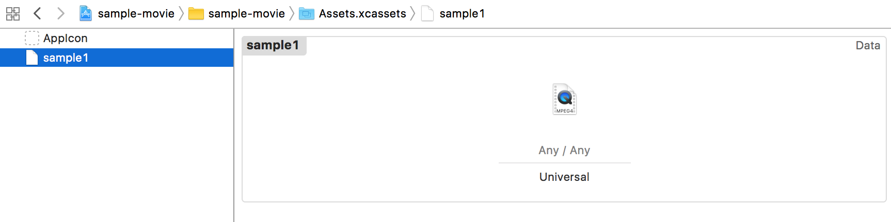

# 動画再生機能を作ってみよう

### はじめに
* 背景
	* 動画再生最近流行ってる
	* やってみたいと思った
* 今回の記事でやることざっと紹介
	* 動画再生に使用するオブジェクト紹介
	* Avplayerの基本
	* シンプルな動画再生（アセットからの再生）
	* youtubeの再生（ライブラリ使用）
		* リポジトリ検索機能つき

### 動画再生するには？
#### 動画再生方法
　動画再生を再生する手段としては2つあります。ざっと紹介していきます。

* UIWebView
* AVPlayer

##### UIWebView
　最も簡単な方法でいうと、こちらの方法になります。`WebView`は、Webページをアプリ内で表示することができる`View`です。
　使い方はシンプルで、URLがあればすぐに実装できてしまいます。
　例えば、`WebView`で`YouTube`を指定すれば、そのアプリはWeb版のYouTubeとまるっきり同じになります。なので、動画再生もアプリ上でそのままされるということになります。アプリ内にブラウザを置けるようなものですね。
　今回`WebView`はメインで取り上げません。以下サンプルコードで動作すると思うので、試してみてください。

```swift:WebViewサンプルコード
import UIKit

class SampleWebViewController: UIViewController {

    @IBOutlet weak var webView: UIWebView!
    
    override func viewDidLoad() {
        super.viewDidLoad()
        
        let requestURL = URL(string: "https://www.youtube.com/")
        let req = URLRequest(url: requestURL!)
        webView.loadRequest(req)
    }
}

```

　注意点としては、実際に表示されるのはWebページなので、ボタン等のオブジェクトに対して操作をすることができません。単純にWebページを表示させたい時に利用してみてください。
　
##### AVPlayer
　`WebView`ではカスタマイズができませんでしたが、こちらのライブラリでは色々カスタマイズすることができます。本格的に動画再生機能を実装したい場合、現在だとこちらを使うことになると思います。例えば、動画再生・停止を制御したり、音声を調整したりです。実装方法は`WebView`と比べるとコード量は増えますが、圧倒的にできることが増えます。
　今回は`AVPlayer`を使った実装を試したので、後ほどの節でサンプルコードとともに紹介します。
　ちなみに、`AVPlayerViewController`オブジェクトが`StoryBoard`に用意されているので、そちらを使えば簡単に`View`を作ることができますよ。
　
#### おまけ
　iOS2~iOS9の間では、`MPMoviePlayer`というものが標準ライブラリで使えました。しかしiOS9から`deprecated`なり、それ以降は`AVPlayer`がメインになったようです。
　なので、簡単に実装したいときは`WebView`、カスタマイズしたい場合は`AVPlayer`と覚えておくと良いかもしれません。

### シンプルな動画再生機能実装
 では`AVPlayer`を使った動画再生機能の実装手順を、以下のような流れで紹介します。今回は、アセットに動画ファイルを登録し、アプリロード時直後に動画を再生する機能を実装してみます。
 
* 動画ファイルの登録
* `ViewController`の設定
* ストーリーボードの実装
* アプリ起動
 
#### アセットに動画ファイルの登録
　今回は、mp4形式の動画ファイルを用意しています。movファイルでも問題ありません。まずは、動画ファイルをアセットに登録しましょう。ドラックするだけでOKです。登録したアセット名はこの後利用するので、覚えておきましょう。



#### `ViewController`の設定
　`ViewController`は`AVPlayerViewController`を継承したクラスを作成します。そして今回は、ロード時に動画再生をするので`viewDidLoad`に動画読み込み処理を記述していきます。
　まずは動画ファイルを参照します。動画ファイルは、アセットから`NSDataAsset `として取り出し、一時ファイルとして`NSTemporaryDirectory`に一度保存します。その保存先URLを参照する形になります。
　まず、一時ファイルとして保存するサンプルコードは以下のようになります。

```
let asset = NSDataAsset(name:"アセット名")
let videoUrl = URL(fileURLWithPath: NSTemporaryDirectory()).appendingPathComponent("アセット名.ファイル形式")
try! asset!.data.write(to: videoUrl)
```

　次はURLを参照して動画を再生させるコードになります。
　サンプルコードは以下のようになります。動画ファイルURLから`AVPlayerItem`を作成し、`AVPlayer`にセットする感じですね。そして、その`AVPlayer`インスタンスを`AVPlayerViewController `がもつプロパティ`player`に代入します。あとは、`AVPlayer`オブジェクトがもつ制御メソッドを実行するだけで、動画ファイルの制御ができます。今回は再生するだけにしておきます。

```
let item = AVPlayerItem(url: videoUrl)
let videoPlayer = AVPlayer(playerItem: item)
player = videoPlayer
player?.play()
```

　クラスの全体像は以下の通りです。

```swift:AVPlayerViewControllerのサンプルコード
import UIKit
import AVKit

class SampleAVPlayerViewController: AVPlayerViewController {

    override func viewDidLoad() {
        super.viewDidLoad()
        
        let asset = NSDataAsset(name:"アセット名")
        let videoUrl = URL(fileURLWithPath: NSTemporaryDirectory()).appendingPathComponent("アセット名.ファイル形式")
        try! asset!.data.write(to: videoUrl)
        let item = AVPlayerItem(url: videoUrl)
        let videoPlayer = AVPlayer(playerItem: item)
        player = videoPlayer
        player?.play()
    }
}
```

#### ストーリーボードの実装
　`AVPlayer`を使って再生するために用意されている、`AVKitPlayerViewController`を使います。まず、オブジェクトライブラリーから以下のアイコンを選択して、引っ張り出しましょう。


　ロード直後に動画を再生させるため、`initial ViewController`に設定しておきましょう。そして、先ほど作成した`ViewController`を`Custom Class`に設定します。

#### アプリ起動
　これでアプリを起動してみましょう。アプリが起動後、動画の読み込みが始まり、再生されます。シンプルな再生機能はこれで実装できますが、`AVPlayer`オブジェクトが持つメソッドを駆使すれば、ボタンパーツ押下時に動画を一時停止させるなど、任意のタイミングで動画を制御することができるので、試してみてください。
　//余白あれば画像

### 発展編~youtubeの動画再生~
* やること紹介
	* リポジトリ検索と再生機能
	* ループ機能
	* バックグラウンド
* ライブラリ紹介
* シンプルな動画再生
* 基本的な設定も紹介（ATSとか）
* リポジトリ検索機能実装
* 両方あわせた実装

### おわりに
* 感想
