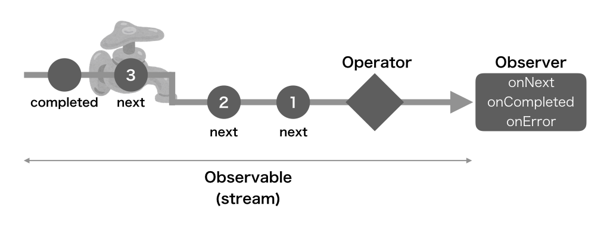
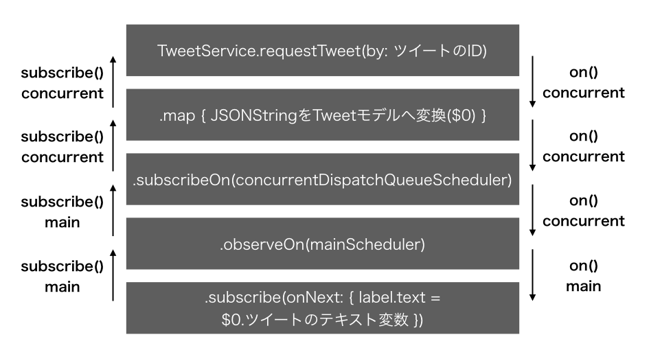

# RxSwift再入門 〜雰囲気で使っている状態から抜け出す〜

## はじめに

みなさん、RxSwift[^1]使ってますか？
プロミス・データバインディング・イベントバス・リストをあれこれする処理など色々できて良いですよね。
ただ、その使い方ってあってるんでしょうか？「全然分からない。俺は雰囲気でRxSwiftを使っている。」状態で使っていませんか？
恥ずかしながら私は完全に雰囲気で使ってしまっていました。

本章は（私含めて）その状態からの脱却を目指す第一弾です。
今回は **RxSwift** を使う上での基本を簡単に説明し、どうやって動いているのかを中心に学んでいきます。
また、本章の内容は主にRxSwiftのgithubリポジトリにある **Rx.playground** [^2]を参考にしています。

対象とする読者のイメージ

- RxSwiftを使ったことがある
- いまいち理解せず雰囲気で使っている

執筆時点の環境

- Xcode: 9.0
- Swift: 3.1
- ReactiveX/RxSwift: master（bd5a9657b9a7cf52f583eecf00dc8b7c0cb9ebaa）

## 登場人物とそれぞれの関係

本章には、RxSwiftを説明する上でObservable,Observer,Operator,Scheduler,Subjectが登場します。

まず、起点となるObservableについて、公式サイト[^3]には

> In ReactiveX an observer subscribes to an Observable

「**Observer** は **Observable** を購読します」と書かれています。
ReaxtiveXでのObserverは、Observerパターンと同じ意味合いで使われ、通知される立場にあります。
Observableに流れているイベントが、n個以上のOperatorを通って、Observerへ到達します。
RxSwiftを使うと何が嬉しいのかというとあらかじめ処理とゴールを決めておき、そこに値が流れてくるように書くことができるため、データフローが明確になります。

イメージの付きやすいように例えると「Observableは蛇口とそこから流れる水」「Operatorは水路にあるフィルタ」のような感じです。蛇口から水が流れ、水路でキレイにしたり・混ぜたり様々な処理が行われながら終着点まで流れます。

重要なのは、「蛇口は開かないと水が流れない」という点です。Observableはsubscribeが呼び出される（蛇口が開く）ことで、初めてストリームが流れ出します。
（例外も存在しますが、これについてはまた後で説明します。）
そして、Observableに流れているイベントはOperatorを通り、subscribeに引数として渡したObserverのonNext,onError,onCompleteに流れ着きます。



## Observableについて

Observableはストリームであり、subscribeされることで初めてストリームにイベントが流れます。
そのストリームに値をonNext,onError,onCompletedというイベントに包んで、購読しているObserverへ通知します。
そしてonNextは複数回、onEror,onCompleteは一度だけ通知することができます。
onErrorもしくはonCompletedを呼んだ後は一切イベントが流れません。

## Operatorについて

OperatorはObservableをsubscribeし、新しくObservableを生成します。
そのため、Operatorは通知をする側(Observable)、購読する側(Observer)両方の性質を持ちます。

```
Observable.of(1, 2, 3).map { $0 * $0 }.filter { $0 % 2 == 0 }
```

例えば、上記のコードの **of**, **map**, **filter** が **Operator** です。
他にも、Observableを生成するOperatorはjust,create、変換・結合するOperatorはmap,flatMap,scanなど他にも様々な種類があります。
Operatorは生成・変換すると新しいObservableが返ってくるため、Operator同士を繋ぐことができます。

## Observerについて

登場人物を紹介したとき

> Observableはsubscribeが呼び出される（蛇口が開く）ことで、初めてイベントが流れ出します。

このよう説明した通り、先程Operatorについて紹介したコードだけでは何も起こりません。
下記のように、subscribeすることで初めてストリームが流れ出します。

```
Observable.of(1, 2, 3).map { $0 * $0 }.subscribe(onNext: { print($0) })
```

このコードでは、1,2,3という値がonNextというイベントに包まれ、それぞれ1,4,9とmapが変換し、ObserverのonNextへ通知されます。

### ObserverとRxSwift3.xで追加された派生系の種類

RxSwift3.x系からはObserverの他に、**Single**,**Completable**,**Maybe** が追加され、通知される**onXXX** が違います。
Observerを含めて表にするとこのようになります。

| Observerの種類 | 動作 |
|:--------:|-----|
| Obsever | onNext(value)が1回以上、onCompleted,onError(error)どちらか1回 |
| Single | onSuccess(value),onError(error)のどちらが1回 |
| Compaletable | onCompleted,onError(error)がどちらか1回 |
| Maybe | onSuccess(value),onCompleted,onError(error)のどれかが1回 |

## Scheduler

ここで、実際に今まで説明したObservable,Operator,Observerを使う時のことを考えてみましょう。
例えば、通信処理で下記のような処理をするとします。

1. ツイートのIDを指定して、それを取得するリクエストを投げる
2. レスポンスを受け取る
3. 受け取ったJSONStringをTweetモデルに変換する
4. できがったモデルをUIへ反映する

この時、1~3はバックグラウンドで、4はメインスレッドで処理をするのが適切です。
そのスレッドの制御をする役割を持つのが **Scheduler** です。
**Scheduler** はiOSの仕組みとして存在するGCD（Grand Central Dispatch）を利用することでスレッド制御を実現しています。
そのSchedulerを指定するためには **observeOn** , **subscribeOn** というOperatorを利用します。

```
TweetService.requestTweet(by: ツイートのID) // Observable<String>を返す  // 1
            .map { JSONStringをTweetモデルへ変換($0) }                  // 2,3
            .subscribeOn(background-scheduler)
            .observeOn(main-scheduler)
            .subscribe(onNext: { label.text = $0.ツイートのテキスト変数 }) // 4
```

これは実際にSchedulerを指定した1~4の流れのコードの例です。
これで1~3はバックグラウンドスレッド、4はメインスレッドで動作します。
きちんとobserveOn,subscribeOnの動作を理解をするためには、 **Observable.subscribe()** の動作を理解する必要があり、後で詳しくみていきます。
この章を見る上では「observeOnは下方向」に適応し、「subscribeOnは上方向」に適応されるぐらいの認識で大丈夫です。

### Schedulerの種類

| Scheduler | 動作 |
|:--------:|-----|
| MainScheduler | メインスレッドで動きます（observeOnに最適化） |
| ConcurrentMainScheduler | メインスレッドで動きます（subscribeOnに最適化） |
| CurrentThreadScheduler | 現在のスレッドで動きます |
| SerialDispatchQueueScheduler | 直列なQueue上でバックグラウンドで動きます |
| ConcurrentDispatchQueueScheduler | 並列なQueue上でバックグラウンドで動きます |

それぞれDispatchQueueを持つ仕組みになっていて、イニシャライザには引数としてDispatchQoSを渡すものとDispatchQueueを渡すものがあります。
DispatchQoSを引数として渡すイニシャライザはiOS8から追加されていて、独自のラベルの設定などの必要がなければDispatchQoSを渡す方が良いです。

### Schedulerで注意すべきこと

まず、Concurrent（並列）なSchedulerで処理されていても、1つのObservableに流れる値は順序が保証されています。
そのため、このコードのようにランダムなスリープを挟んでも実行すると1,2,3と値は順に出力されています。

```
let observeOnScheduler = ConcurrentDispatchQueueScheduler(qos: .default)

var count = 0
Observable.from(1...3)
    .observeOn(observeOnScheduler)
    .do(onNext: { i in
        let time = arc4random_uniform(3) + 1 // 1~3秒のスリープ
        print("observable sleep \(time)")
        sleep(time)
        count += 1
        print("observable \(i): \(count)")
    })
    .subscribe()

// 出力
A observable sleep 2
A observable 1: 1
A observable sleep 1
A observable 2: 2
A observable sleep 1
A observable 3: 3
```

では、同じ並列なScheduerで2つのObservableをsubscribeしたらどうなるでしょうか？

```
let observeOnScheduler = ConcurrentDispatchQueueScheduler(qos: .default)

var count = 0
Observable.from(1...3)
    .observeOn(observeOnScheduler)
    .do(onNext: { i in
        let time = arc4random_uniform(3) + 1 // 1~3秒のスリープ
        print("A observable sleep \(time)")
        sleep(time)
        count += 1
        print("A observable \(i): \(count)")
    })
    .subscribe()

Observable.from(4...6)
    .observeOn(observeOnScheduler)
    .do(onNext: { i in
        let time = arc4random_uniform(3) + 1 // 1~3秒のスリープ
        print("B observable sleep \(time)")
        sleep(time)
        count += 1
        print("B observable \(i): \(count)")
    })
    .subscribe()

// 出力
B observable sleep 2
A observable sleep 1
A observable 1: 1
A observable sleep 1
B observable 4: 2
B observable sleep 3
A observable 2: 3
A observable sleep 3
B observable 5: 4
B observable sleep 1
A observable 3: 5
B observable 6: 6
```

Concurrent（並列）なSchedulerで処理しているため、共有された変数countとObservableに流れる値が同じにならず、並列で動いていることがわかります。
では、Serial（直列）なSchedulerに変えてみましょう。

```
let observeOnScheduler = SerialDispatchQueueScheduler(qos: .default)

var count = 0
Observable.from(1...3)
    .observeOn(observeOnScheduler)
    .do(onNext: { i in
        let time = arc4random_uniform(3) + 1
        print("A observable sleep \(time)")
        sleep(time)
        count += 1
        print("A observable \(i): \(count)")
    })
    .subscribe()

Observable.from(4...6)
    .observeOn(observeOnScheduler)
    .do(onNext: { i in
        let time = arc4random_uniform(3) + 1
        print("B observable sleep \(time)")
        sleep(time)
        count += 1
        print("B observable \(i): \(count)")
    })
    .subscribe()

// 出力
A observable sleep 2
A observable 1: 1
A observable sleep 1
A observable 2: 2
A observable sleep 2
A observable 3: 3
B observable sleep 3
B observable 4: 4
B observable sleep 1
B observable 5: 5
B observable sleep 1
B observable 6: 6
```

それぞれランダムにスリープがかかっていることにも関わらず、共有された変数countとObservableに流れる値が同じになっていて、直列に動いていることがわかります。

さて、このSchedulerの指定で大事なのがObservableをsubscribeした時、observeOn,subscribeOnでSchedulerを指定していない場合は **CurrentThreadScheduler** (今いるスレッドで実行するScheduler)で実行されるということです。
つまり、何も考えずにメインスレッドで動いている処理中にsubscribeしてしまうと、重い処理をメインスレッドで処理してしまいます。

普段コードを書いている時に、これまでに示してきたようにObservableをそれぞれ生成してsubscribeすることなんてないからあまり関係なさそうだと思う人がいるかもしれませんが、実は普段からよく発生している処理です。
それがどんなときかというと、zip,mergeなどObservableを結合して処理を行う場合です。

```
let observeOnScheduler =
  // ConcurrentDispatchQueueScheduler or SerialDispatchQueueScheduler

let aObservable = Observable.from(1...3)
    .observeOn(observeOnScheduler)
    .do(onNext: { i in
        sleep(UInt32(3))
    })

let bObservable = Observable.from(4...6)
    .observeOn(observeOnScheduler)
    .do(onNext: { i in
        sleep(UInt32(3))
    })

Observable.zip(aObservable, bObservable, resultSelector: { e1, e2 in
    print("e1: \(e1), e2: \(e2)")
}).subscribe()
```

このコードは、今までに説明で利用してきたObservableのスリープ処理だけを残し変数化してzipで結合したものをsubscribeしています。
ConcurrentDispatchQueueSchedulerを指定した場合は、並列で走るため「3秒スリープ×3回分」の時間で完了します。
しかし、SerialDispatchQueueSchedulerを指定した場合は、直列で走るため「3秒スリープ×3回×2つObservable分」の時間がかかってしまいます。
通信処理の待ち合わせなどでzip,mergeなどを使っていて、なぜか遅いなと思ったらSchedulerを疑ってみると良いかもしれません。

## Subject

登場人物を紹介したとき

> Observableはsubscribeが呼び出される（蛇口が開く）ことで、初めて流れ出します。
>（例外も存在しますが、これについてはまた後で説明します。）

この時説明した例外が、この章で説明する **Subject** です。
**Subject** もObservableです。しかし、初めから蛇口が開いている状態、つまり初めからストリームが流れています。
というと語弊があるかもしれませんが、subscribeされていなくてもイベントを流すことができるということです。

```
let subject = PublishSubject<String>()
subject.onNext("1") // subscribeされていなくてもイベントを流せる
subject.subscribe(onNext: { print("subscribe: \($0)") })
subject.onNext("2")
subject.onCompleted()
subject.onNext("3") // Observableと同じく既にonCompletedが呼ばれているのでイベントが流れない

出力
A subscribe: 2
```

基本はObservableと同じ性質であるため、onNext,onCompleted,onErrorを呼ぶことができます。
また、onCompleted,onErrorのどちらかが呼ばれてしまうと、その後はイベントを流すことができません。
そのため、上記のコードではsubscribeした後からonCompletedが呼ばれる前までのonNextのみの通知をObserverが受け取っています。

### Subjectの種類

| Subject | 動作 |
|:--------:|-----|
| PublishSubject | キャッシュせず、来たイベントをそのまま通知する |
| ReplaySubject | 指定した値だけキャッシュを持ち、<br>subscribe時に直近のキャッシュしたものを通知する |
| BehaviorSubject | 初期値を持つことができ、1つだけキャッシュを持ち、<br>subscribe時に直近のキャッシュしたものを通知する |
| Variable | 変数のように扱うことができ、<br>valueプロパティを変更するとonNextを通知する ※RxSwift独自 |

## HotとCold

基本的にObservableは、subscribeするまでストリームが流れません。
その例外としてSubjectを利用したObservableは、常にストリームが流れています。
これを **ReactiveX** の概念では **Hot,Cold** と言います。

```
let hotObservable = Observable
    .from(1...3)
    .publish()

hotObservable.subscribe(onNext: { i in
    print("subscribe onNext \(i)")
})

hotObservable.connect()
```

上記の **publish** というOperatorは **Cold->Hot** に変換します。
Cold->Hotの変換は、multicastというメソッドで「ColdなObservableをsubscribe時にSubjectで包む」仕組みです。
また、HotなObservableは自身が参照している（1つ前にチェーンされている）Observableのsubscribeを呼び出す性質を持ちます。

しかし、上記のコードでhotObservable.subscribe()した時点ではイベントが流れていません。
publishで返ってくるのはConnectableObservableという型で、connectされることで初めてストリームが流れ出し、その時にsubscribeされているものに対してイベントが流れます。

```
let hotObservable = Observable
        .from(1...3)
        .do(onNext: { print("onNext: \($0)") })
        .publish()

hotObservable.connect()

出力
onNext: 1
onNext: 2
onNext: 3
```

また、subscribeされなくとも値は流れることは上記のコードの出力見ればわかるでしょう。

Hot,Coldの違いは、他にもあります。
例えば、HotなObservableは複数のsubscribeに対してストリームを共有しています。

```
var count = 0
let hotObservable = Observable
    .from(1...3)
    .do(onNext: { i in
        count += 1
        print("doOnNext \(i), count:\(count)")
    })
    .publish()

hotObservable.subscribe(onNext: { i in
    print("1 subscribe onNext \(i)")
})
hotObservable.subscribe(onNext: { i in
    print("2 subscribe onNext \(i)")
})

hotObservable.connect()


出力
doOnNext 1, count:1
1 subscribe onNext 1
2 subscribe onNext 1
doOnNext 2, count:2
1 subscribe onNext 2
2 subscribe onNext 2
doOnNext 3, count:3
1 subscribe onNext 3
2 subscribe onNext 3
```

```
var count = 0
let coldObservable = Observable
    .from(1...3)
    .do(onNext: { i in
        count += 1
        print("doOnNext \(i), count:\(count)")
    })

coldObservable.subscribe(onNext: { i in
    print("1 subscribe onNext \(i)")
})
coldObservable.subscribe(onNext: { i in
    print("2 subscribe onNext \(i)")
})


出力
doOnNext 1, count:1
1 subscribe onNext 1
doOnNext 2, count:2
1 subscribe onNext 2
doOnNext 3, count:3
1 subscribe onNext 3
doOnNext 1, count:4
2 subscribe onNext 1
doOnNext 2, count:5
2 subscribe onNext 2
doOnNext 3, count:6
2 subscribe onNext 3
```

ストリームを共有しているため、上記の出力のように複数のsubscribeがあった場合に1,2,3がそれぞれイベントが共有され、2つのsubscribeに対して「同時」に流れています。
Coldの場合はイベントが複製され、それぞれのsubscribeに対して「別々」に流れています。

### Cold -> Hot変換で注意すべきこと

Cold->Hot変換したConnectableObservableでは注意しないといけないことがあります。
それは、connectしたObservableをdispose(unSubscribe)しないと開放されないということです。
しかし、正しいタイミングを気にしながらdisposeするのはとても難しいことです。
そこで、ConnectableObservableは **refCount()** というメソッドを持っています。

```
let hotObservable = Observable
    .from(1...3)
    .publish()
    .refCount()

hotObservable.subscribe(onNext: { i in
    print("subscribe onNext \(i)")
})

出力
subscribe onNext 1
subscribe onNext 2
subscribe onNext 3
```

**refCount()** を呼び出すと、内部でconnectが呼び出しています。
そして、全てのsubscribeがdisposeされると、自動でObservableをdisposeしてくれます。
これはiOSで使われているメモリ管理のARCと同じ仕組みで「subscribe毎にカウントアップ」「dispose毎にカウントダウン」されます。
そしてカウントが0になった時にdisposeされるため、disposeのタイミングを意識しなくて良くなります。

> publishで返ってくるのはConnectableObservableという型で、connectされることで初めてストリームが流れ出し、その時にsubscribeされているものに対してイベントが流れます。

先程はこのように説明しました。上記のコードはrefCount内でconnectされていて、その時点ではsubscribeされていません。
しかし、その後に呼び出したsubscribeにイベントが流れています。
これはrefCount()による作用で、refCount()を呼び出すとconnectされているのにも関わらず、それ以降subscribeされるまでイベントが流れないようになります。

では、次に複数回subscribeしてみましょう。

```
let hotObservable = Observable
    .from(1...3)
    .publish()
    .refCount()

hotObservable.subscribe(onNext: { i in
    print("1 subscribe onNext \(i)")
})
hotObservable.subscribe(onNext: { i in
    print("2 subscribe onNext \(i)")
})

出力
1 subscribe onNext 1
1 subscribe onNext 2
1 subscribe onNext 3
```

2つsubscribeしているはずが、最初のsubscribeにしかイベントが流れていません。
これはストリームを共有しているため、初めにsubscribeした時点でそれに対してイベントが流れ、2つ目のsubscribeの時点では、既に流れたイベントは終えているため流れないということです。

```
var count = 0
let hotObservable = Observable
    .from(1...3)
    .do(onNext: { i in
        count += 1
        print("doOnNext \(i), count:\(count)")
    })
    .replay(3)
    .refCount()

hotObservable.subscribe(onNext: { i in
    print("1 subscribe onNext \(i)")
})

hotObservable.subscribe(onNext: { i in
    print("2 subscribe onNext \(i)")
})

出力
doOnNext 1, count:1
1 subscribe onNext 1
doOnNext 2, count:2
1 subscribe onNext 2
doOnNext 3, count:3
1 subscribe onNext 3
2 subscribe onNext 1
2 subscribe onNext 2
2 subscribe onNext 3
```

これはreplyというCold->Hot変換のOperatorを使ったコードです。
publishはPublishSubjectを利用するのに対して、replayはReplaySubjectを利用しているため、上記の出力のように2つ目のsubscribeにもキャッシュしてあるイベントが流れます。

また、 **.publish().refCount()はshare()** 、 **.replay().refCount()はshareReplay()** というエイリアス的なメソッドが用意されています。
ここまでは動作を理解するためにそれぞれを呼んでいましたが、動作を理解した上ではshare(),shareReplay()を使った方が良いでしょう。

## Observable.subscribe()の動作

ではここで振り返りながら、Observable.subscribe()するとどのように動作するのか、もう少し細かく見ていきましょう。

```
TweetService.requestTweet(by: ツイートのID) // Observable<String>を返す
            .map { JSONStringをTweetモデルへ変換($0) }
            .subscribeOn(concurrentDispatchQueueScheduler)
            .observeOn(mainScheduler)
            .subscribe(onNext: { label.text = $0.ツイートのテキスト変数 })
```

これはSchedulerの章で示した、ツイートを取得するコードです。
このコードを実行すると、バックグラウンドでツイートを取得し、文字列からモデルへ変換します。そして、メインスレッドでそのモデルを使い描画します。

まず当然ですが、実行するためには最低限必要なObservableとObserverが出てきます。
Observableは通知する、Observerは購読する立場にあります。
この「通知する」というのは、 **on(event)** メソッドを呼び出すということです。
また、「購読する」というのは、 **subscribe()** メソッドを呼び出すということです。
そして、ColdなObervableは購読しなければ通知することはありません。

何が言いたいかというと、一連のOperatorが繋がれた最後にsubscribeすると、繋がれたOperatorを最初にObservableを生成したところまで購読(subscribe)していきます。
これがコードでは上るようなイメージになります。

そして、頂点に着くとsubscribeを呼び出したObserverに対してon(event)によってイベントを通知していきます。この時初めのon(event)が呼ばれるスレッドは、最後にsubscribe()されたスレッドになります。これがコード上では下るようなイメージになります。

その中で、subscribeOnはsubscribe()の呼び出しにSchedulerを適応し、observeOnはon(event)の呼び出しにSchedulerを適応します。
そのため、subscribeOnは上方向に適応され、observeOnは下方向に適応されます。



また、Observableに流れるイベントが複数ある場合はそれぞれが繋がれたOperatorを1つずつ通り、最後のObserverまで到達します。
繋がれたOperatorで全てのイベントが処理されてから次のOperatorへ行くのではないということです。

冒頭でも言いましたが、あらかじめOperatorで処理をObeserberでゴールを決めておき、そこに値がイベントに包まれて流れてくることができるため、データフローが明確になります。

## Operatorを自作してみる

ここでもう少し理解を深めるために、今までに使ってきたOperatorを作ってみましょう。
OperatorはObservableTypeのextensionとして実装されています。
ちなみにObservableを最初に生成するof,from,createなどのメソッドはObservableのextensionとして実装されています。

```
import RxSwift

public struct Logger {
    static func debug(_ string: String) {
        print(string)
    }
}

extension ObservableType {
    public func myDebug(identifier: String) -> Observable<Self.E> {
        return Observable.create { observer in
            Logger.debug("subscribed \(identifier)")
            let subscription = self.subscribe { e in
                Logger.debug("event \(identifier) \(e)")
                switch e {
                case .next(let value):
                    observer.on(.next(value))
                case .error(let error):
                    observer.on(.error(error))
                case .completed:
                    observer.on(.completed)
                }
            }
            return Disposables.create {
                Logger.debug("disposing \(identifier)")
                subscription.dispose()
            }
        }
    }
}

Observable.from(1...3).myDebug(identifier: "from").subscribe()


出力
subscribed from
event from  next(1)
event from  next(2)
event from  next(3)
event from  completed
disposing from
```

上記のコードは既存で実装されているdebugというOperatorの動作を模して、独自ロガーで出力するようにしたものです。

既存のOperatorを見ると **Debug(Observable)**,**DebugSink(Observer)** というクラスで実装されていますが、createを利用することで簡単に独自のOperatorを作ることができます。
createに渡すクロージャがsubscribeされた時の動作です。subscribeされるとログを流し自身が参照している（1つ前にチェーンされている）Observableをsubscribeします。
そのsubscribe時にsubscribeされたこと、イベントが通知された時にイベントの内容、disposeされた時にdisposeされたことをそれぞれログを流しています。

## おわりに

どうでしたか？「全然分からない。俺は雰囲気でObservableを使っている。」状態からは抜け出せたでしょうか？

実はRxSwiftについて書き始めた時は「ユースケースで学ぶRxSwift」というタイトルで進めていたのですが、まず基本を理解しないといけないなと思って書いているとあっという間にページが埋まってしまいました。
また訪れるであろう技術書典で、第二弾として書きたいなと思っています。

もし本章の内容に間違い・紛らわしい内容があれば Twitter: @roana0229 までメンションしていただけると嬉しいです。感想もお待ちしております。

[^1]: https://github.com/ReactiveX/RxSwift
[^2]: https://github.com/ReactiveX/RxSwift/tree/master/Rx.playground
[^3]: http://reactivex.io/documentation/observable.html
