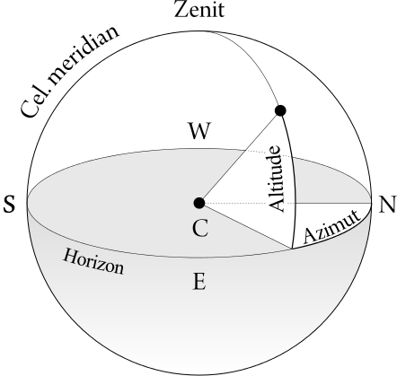
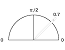
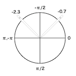
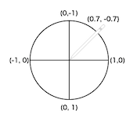
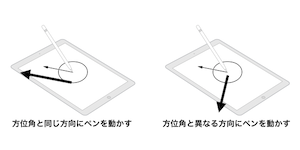

# Apple Pencilに対応したお絵かきアプリを作ってみよう
## はじめに
こんにちは。shinfkdです。  
普段はとある目黒のWeb企業で、人事としてエンジニア採用担当をやっています。  
採用担当であるがゆえに、普段はほとんどコードを書く仕事をしておりません。  
が、新卒採用イベントなどにはよく行きます。  
人事が新卒採用イベントに何を持っていくのか…?  
そう、iPad Proです。  
iPad Proは、学生に向けて会社紹介のプレゼン資料を見せたり、オフィスの様子の写真を見せたり、メモを取るのに最適です。

すみません、、、嘘をつきました。  
プレゼン資料を見せたり、オフィスの様子を見せるのに、iPad Proはとても便利なのですが、さすがにメモを取るのには苦労をしてしまいます。  
PCでメモをとるのとは違い、タッチパネルで文字入力をするのには、どうしても時間がかかってしまうのです。  
でも、待ってください。iPad Proにはアレがあります。  
そう、Apple Pencilです。

そう思った私は、思い立ったが吉日とばかりに、Apple Pencilをポチりました。  
前置きが長くなりましたが、今回はせっかくApple Pencilを手に入れたので、自分でもApple Pencilを用いたアプリ開発をしてみようと思った次第です。

## Apple Pencilの特徴
Apple Pencilは2015年の11月に発売され、2017年9月現在のところ、対応しているのはiPad Proのみとなっています。  
いくつかの特徴がありますが、代表的なものを挙げると下記のようになります。

* 指では取得できない、ペンの傾きと、方向を取得できる
* 秒間240回に及ぶスキャン
 * 指の場合は秒間120回。ディスプレイのリフレッシュレートは、10.5インチモデル及び、第2世代12.9インチモデルは120Hz。それ以前は60Hz。
* 筆圧を取得できる
 * iPhone 6s以降に搭載されている3D Touchとは異なり、Apple Pencil側で筆圧を計測している

中でも、一番の特徴となる「指との違い」について見ていきましょう。

## Apple Pencilと指での、取得できる情報の違い
上述もしたとおり、Apple Pencilと指とでは、その取得できる情報に違いがあります。  
具体的には、Apple Pencilを利用した場合、`Altitude(高度)`と`Azimuth(方位角)`、それから`Force(筆圧)`の3つが取得できるようになります。



Altitudeは、高さを意味します。  
図3.1を見ていただくとわかるように、Cをペン先と見た場合に、Altitudeはペンの傾きを意味しています。  
またAzimuthは、方位角を意味します。  
同じく図で見た場合に、Azimuthはペンの向きを指していることがわかります。  

## 値の取得
上述した情報を取得するには、指で画面をタッチした場合と同じく、UITouchクラスを用います。  
指とApple Pencilを用いた場合の違いは、UITouchTypeの違いとなります。

### Apple Pencilを識別する (UITouchType)
UITouchTypeに、iOS9.1から新たな種別であるStylusが追加されました。  
これにより、Apple Pencilの場合のみを識別して値を取得することができます。

``` UITouchType
@available(iOS 9.0, *)
public enum UITouchType : Int {

    case direct // A direct touch from a finger (on a screen)

    case indirect // An indirect touch (not a screen)

    @available(iOS 9.1, *)
    case stylus // A touch from a stylus
}
```

* **direct**: 指でタッチした場合
* **indirect**: 画面以外でデバイスを用いてタッチした場合
* **stylus**: Apple Pencilを用いた場合

indirectは使用シーンがわかりづらいですが、英語版ドキュメントに下記のようにあったため、Apple TVなどのリモコンを用いた際に使用されるようです(手元に実機がないので未検証)。
> Indirect touches are generated by touch input devices that are separate from the screen. For example, the trackpad of an Apple TV remote generates indirect touches.  
>
>https://developer.apple.com/documentation/uikit/uitouchtype/uitouchtypeindirect

### Altitudeを取得する
Altitudeは、`UITouch.altitudeAngle`より取得することができます。
Altitudeの値はラジアンで表現され、ペンがiPadのスクリーン面に対して水平になったときに値は0となり、スクリーンに対して直角のときに π/2となります。



``` UITouch.altitudeAngleの取得
override func touchesMoved(_ touches: Set<UITouch>, with event: UIEvent?) {
    guard let altitudeAngle = touches.first?.altitudeAngle else { return }
    print("altitudeAngle = \(altitudeAngle)") // altitudeAngle = 0.380229310193334
}
```

### Azimuthを取得する
Azimuthの値には、「方位角」で取得する方法と「ベクトル」で取得する方法の2通りが存在します。どちらを利用するかは、シーンによって異なると思いますので、お好きな方をお選びください。

#### 方位角で取得する
AzimuthをAltitudeと同じくラジアンで取得するには、`UITouch.azimuthAngleInView`を使用します。  
方位角は、画面右を0とし、そこから時計回りにペンを向けた場合値が増えていき、6時の方向でπ/2、9時でπとなります。反時計回りの場合は、マイナス値となり、0時で -π/2、9時でπとなります。



``` UITouch.azimuthAngleInViewの取得
override func touchesMoved(_ touches: Set<UITouch>, with event: UIEvent?) {
    guard let azimuthAngle = touches.first?.azimuthAngle(in: self) else { return }
    print("azimuthAngle = \(azimuthAngle)")
    // azimuthAngle = -1.98289489746094
}
```

#### ベクトルで取得する
Azimuthをベクトル値で取得するには、`UITouch.azimuthUnitVector`を使用します。  




``` UITouch.azimuthUnitVectorの取得
override func touchesMoved(_ touches: Set<UITouch>, with event: UIEvent?) {
    guard let azimuthVector =
        touches.first?.azimuthUnitVector(in: self) else { return }
    print("azimuthVector = \(azimuthVector)")
    // azimuthVector = CGVector(dx: -0.400533091690527, dy: -0.916282294088906)
}
```

### 筆圧を取得する
筆圧は、Apple Pencilをスクリーンに押し付ける強さによって上下し、取得するには `UITouch.force` を使用します。  
この値は、iPad Proの場合、Apple Pencilを使わずに指で押した場合は常に0になり取得できませんが、3D Touchを搭載しているiPhoneの場合は取得可能になります。

```　UITouch.forceの取得
override func touchesMoved(_ touches: Set<UITouch>, with event: UIEvent?) {
    guard let force = touches.first?.force else { return }
    print("force = \(force)") // force = 2.30229288736979
}
```

## 画面に線を引いてみる
さて、ここまでApple Pencilの特性について解説をしてまいりましたが、実際に画面に線を引いてみましょう。  
まずは、Apple Pencilの特性を使わず、指でも書けるものから。  
今回のテーマは、Apple Pencilを使う部分メインのため、ここまでの詳細解説は省略します。

``` 基本形
class CanvasView: UIImageView {
    private let minLineWidth: CGFloat = 6
    private let maxLineWidth: CGFloat = 15
    private let drawColor: UIColor = UIColor.orange

    override func touchesMoved(_ touches: Set<UITouch>, with event: UIEvent?) {
        guard let touch = touches.first else { return }

        UIGraphicsBeginImageContextWithOptions(bounds.size, false, 0.0)
        let context = UIGraphicsGetCurrentContext()

        image?.draw(in: bounds)
        drawStroke(context: context, touch: touch)

        image = UIGraphicsGetImageFromCurrentImageContext()
        UIGraphicsEndImageContext()
    }

    private func drawStroke(context: CGContext?, touch: UITouch) {
        let previousLocation = touch.previousLocation(in: self)
        let currentLocation = touch.location(in: self)

        drawColor.setStroke()

        // 線の属性を設定をする
        context?.setLineWidth(minLineWidth)
        context?.setLineCap(.round)

        // 線のポイントを設定する
        context?.move(to: CGPoint(x: previousLocation.x, y: previousLocation.y))
        context?.addLine(to: CGPoint(x: currentLocation.x, y: currentLocation.y))

        // 線を引く
        context?.strokePath()
    }
}
```

それでは、このコードに手を加えて、Apple Pencilを有効に使っていってみましょう。

## 線を滑らかにする
Apple Pencilの特徴で書いた通り、Apple Pencilは、指で書いたのに比べて倍の回数である秒間240回のスキャンを行います。  
これは通常アプリにタッチが届けられるよりも高いレートであり、多くのアプリはこれほどまでの正確性を必要としておらず、余計なオーバーヘッドを招きたくありません。  
そのため、通常の `touches`で得られるタッチはApple Pencilがスキャンした全ての情報を含んでいません。  

しかし、Apple Pencilが活躍するシーンである、ペインティングアプリケーションなどではより精緻なスキャン情報を必要とします。  
そこで使われるのが `UIEvent.coalescedTouches` メソッドです。  
このメソッドを用いると、システムが前回受信したものの、配信されていない追加のタッチ情報を得ることができます。
実際に利用して書き換えたコードが下記になります。

``` coalescedTouches
override func touchesMoved(_ touches: Set<UITouch>, with event: UIEvent?) {
    guard let touch = touches.first else { return }
    guard let coalescedTouches = event?.coalescedTouches(for: touch) else { return }

    UIGraphicsBeginImageContextWithOptions(bounds.size, false, 0.0)
    let context = UIGraphicsGetCurrentContext()

    image?.draw(in: bounds)

    for touch in coalescedTouches {
        drawStroke(context: context, touch: touch)
    }

    image = UIGraphicsGetImageFromCurrentImageContext()
    UIGraphicsEndImageContext()
}
```

これで、より正確な描画ができるようになりました。次からはいよいよApple Pencilを活用した機能を追加しましょう。

## ペンの傾きにより太さを決める
まずはペンの傾きにより、線の太さを変えるところからです。  
以下のコードでは、15°から90°内での、Apple Pencilの傾き度合いに応じ、比率を算出して、最大線幅に掛け合わせることにより線の幅を決定させています。

``` Altitudeによる線の太さ変更
private func lineWidth(_ touch: UITouch) -> CGFloat {
    // ペンの傾きにより線の太さを決める
    return maxLineWidth * altitudeAngleRate(touch)
}

private func altitudeAngleRate(_ touch: UITouch) -> CGFloat {
    let minAltitudeAngle:CGFloat = CGFloat(Double.pi / 12) // 15°
    let maxAltitudeAngle:CGFloat = CGFloat(Double.pi / 2)  // 90°

    let altitudeAngle = touch.altitudeAngle < minAltitudeAngle
        ? minAltitudeAngle : touch.altitudeAngle

    // 傾きにより変化させる太さの比率を求める。
    // 最低傾き(15°)以下の場合に線が最も太くなるようにし、ペンが直立時(90°)に最も細くなるようにする。
    return 1 - ((altitudeAngle - minAltitudeAngle)
        / (maxAltitudeAngle - minAltitudeAngle))
}
```

## ペンの方位角と線を引く方向により線の太さを変える
次に、ペンの方位角と線を引く方向により、線の太さを変えるための記述です。  
文章だけですとわかりづらいかと思いますので、下記の図をご覧ください。



この図のように、ペンが向いている方角に向かって線を引く場合は線を細く、異なる方向に線を引く場合は太くするためのものとなります。この際、MAX値は90°となりますので、ペンの方位と、線を引いている方向の差分の角度を取り、それが90°に対してどの程度の割合かで太さを決定します。

``` AzimuthlineWidth
private func lineWidth(_ touch: UITouch) -> CGFloat {
    // ペンの傾きにより線の太さを決める
    var lineWidth = maxLineWidth * altitudeAngleRate(touch)
    // 方位角で求めた太さに傾きの係数をかけ合わせる
    lineWidth = lineWidth * azimuthAngleRate(touch)

    return lineWidth > minLineWidth ? lineWidth : minLineWidth
}

private func azimuthAngleRate(_ touch: UITouch) -> CGFloat {
    let previousLocation = touch.previousLocation(in: self)
    let location = touch.location(in: self)
    let pi: CGFloat = CGFloat(Double.pi)
    // 現在のペンの方位角を取る
    let penAngle = touch.azimuthAngle(in: self)

    // 線の向きから角度を取る
    let strokeVector = CGPoint(x: location.x - previousLocation.x,
                               y: location.y - previousLocation.y)
    let strokeAngle = atan2(strokeVector.y, strokeVector.x)

    // 線の角度とペンの方位角の差分を絶対値で取る
    var angle = abs(strokeAngle - penAngle)

    // 差分角度がMAXで90°になるようにする
    if angle > pi {
        angle = 2 * pi - angle
    }
    if angle > pi / 2 {
        angle = pi - angle
    }

    // 90°に対する差分角度の割合を求める
    return angle / (pi / 2)
}
```

## 筆圧によって線の太さを変える
最後に、筆圧です。筆圧についてはすごく単純で、最後に筆圧自身を係数として掛けています。  
ただし注意するのが、iPad Proの場合に `UITouch.force` は指を使用すると常に0になるという点です。また、Apple Pencilを用いた場合でも、値は0から始まるため、普通にそのまま掛け合わせてしまうと非常に線が細くなってしまいます。そのため、両方の課題を解決するため、1以上の場合のみ実行するよう分岐を入れます。

``` 筆圧の反映
private func lineWidth(_ touch: UITouch) -> CGFloat {
    ...
    lineWidth = lineWidth > minLineWidth ? lineWidth : minLineWidth
    if touch.force >= 1 {
        lineWidth = lineWidth * touch.force
    }

    return lineWidth
}
```

## 完成形
これで、一通りの処理が書けました。以下が、完成形となります。  
正直、ペイントアプリとして利用するにはまだまだ改善をしなければならないことが多いのですが、まずはApple Pencilを利用する際の取っ掛かりとして、ご参考までに。;)

``` CanvalView
class CanvasView: UIImageView {
    private let minLineWidth: CGFloat = 4
    private let maxLineWidth: CGFloat = 16
    private let drawColor: UIColor = UIColor.orange

    override func touchesMoved(_ touches: Set<UITouch>, with event: UIEvent?) {
        guard let touch = touches.first else { return }
        guard let coalescedTouches =
            event?.coalescedTouches(for: touch) else { return }

        UIGraphicsBeginImageContextWithOptions(bounds.size, false, 0.0)
        let context = UIGraphicsGetCurrentContext()

        image?.draw(in: bounds)

        for touch in coalescedTouches {
            drawStroke(context: context, touch: touch)
        }

        image = UIGraphicsGetImageFromCurrentImageContext()
        UIGraphicsEndImageContext()
    }

    private func drawStroke(context: CGContext?, touch: UITouch) {
        let previousLocation = touch.previousLocation(in: self)
        let currentLocation = touch.location(in: self)

        drawColor.setStroke()

        // 線の属性を設定をする
        context?.setLineWidth(lineWidth(touch))
        context?.setLineCap(.round)

        // 線のポイントを設定する
        context?.move(to: CGPoint(x: previousLocation.x, y: previousLocation.y))
        context?.addLine(to: CGPoint(x: currentLocation.x, y: currentLocation.y))

        // 線を引く
        context?.strokePath()
    }

    private func lineWidth(_ touch: UITouch) -> CGFloat {
        // ペンの傾きにより線の太さを決める
        var lineWidth = maxLineWidth * altitudeAngleRate(touch)

        // 方位角で求めた太さに傾きの係数をかけ合わせる
        lineWidth = lineWidth * azimuthAngleRate(touch)

        lineWidth = lineWidth > minLineWidth ? lineWidth : minLineWidth
        if touch.force >= 1 {
            lineWidth = lineWidth * touch.force
        }

        return lineWidth
    }

    private func altitudeAngleRate(_ touch: UITouch) -> CGFloat {
        let minAltitudeAngle:CGFloat = CGFloat(Double.pi / 12) // 15°
        let maxAltitudeAngle:CGFloat = CGFloat(Double.pi / 2)  // 90°

        let altitudeAngle = touch.altitudeAngle < minAltitudeAngle
            ? minAltitudeAngle : touch.altitudeAngle

        // 傾きにより変化させる太さの比率を求める。
        // 最低傾き(15°)以下の場合に線が最も太くなるようにし、ペンが直立時(90°)に最も細くなるようにする。
        return 1 - ((altitudeAngle - minAltitudeAngle)
            / (maxAltitudeAngle - minAltitudeAngle))
    }

    private func azimuthAngleRate(_ touch: UITouch) -> CGFloat {
        let previousLocation = touch.previousLocation(in: self)
        let location = touch.location(in: self)
        let pi: CGFloat = CGFloat(Double.pi)
        // 現在のペンの方位角を取る
        let penAngle = touch.azimuthAngle(in: self)

        // 線の向きから角度を取る
        let strokeVector = CGPoint(x: location.x - previousLocation.x,
                                   y: location.y - previousLocation.y)
        let strokeAngle = atan2(strokeVector.y, strokeVector.x)

        // 線の角度とペンの方位角の差分を絶対値で取る
        var angle = abs(strokeAngle - penAngle)

        // 差分角度がMAXで90°になるようにする
        if angle > pi {
            angle = 2 * pi - angle
        }
        if angle > pi / 2 {
            angle = pi - angle
        }

        // 90°に対する差分角度の割合を求める
        return angle / (pi / 2)
    }
}
```
